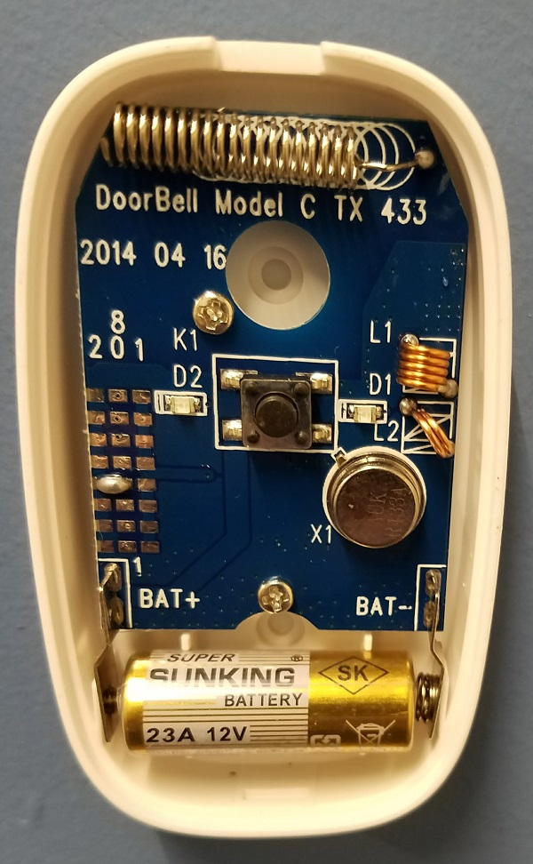

# Doorbell Ringer/Jammer

## This project was inspired from two great tutorials:

[How to Hack Wireless Remotes with Radio Replay Attacks - Hak5 1909](https://youtu.be/F3bISk5t8cA)

[Digital Ding Dong Ditch - Samy Kamkar](https://samy.pl/dingdong/)

My project basically the same as Samy Kamkar's excellent and humorous digital ding dong ditch project.  I used slightly different hardware and signal decoding techniques.  My arduino sketch allows the doorbell signal payload to easily be defined.

## The Target

We will be hacking the SadoTech CXR Wireless Doorbell

If we open the ringer, we can see some interesting information, such as what looks like the operating frequency of 433 MHz.

